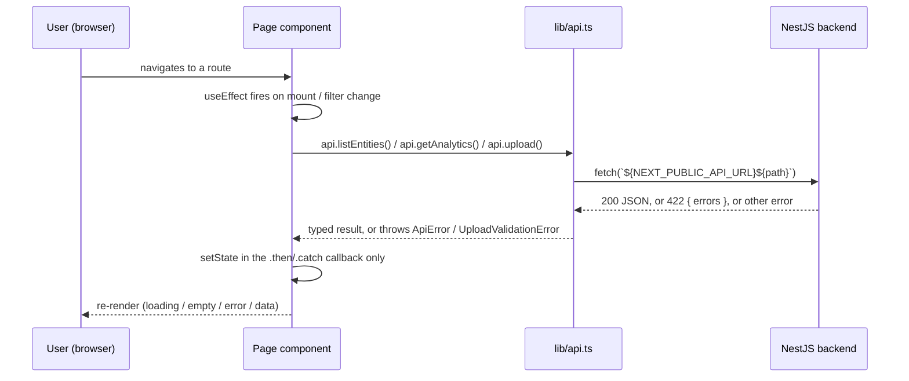

# Frontend route logic

One doc per page/route, focused on **what happens in the component** — state,
effects, and the request/response flow against the backend. Setup/deployment
is in the [top-level README](../../README.md).

| Route | File | Doc | Purpose |
|---|---|---|---|
| `/` | [`src/app/page.tsx`](../../src/app/page.tsx) | [home.md](./home.md) | Searchable/filterable entity list, one level of expansion |
| `/upload` | [`src/app/upload/page.tsx`](../../src/app/upload/page.tsx) | [upload.md](./upload.md) | Three-file upload with client + server validation |
| `/analytics` | [`src/app/analytics/page.tsx`](../../src/app/analytics/page.tsx) | [analytics.md](./analytics.md) | Filterable four-chart analytics dashboard |

## Shared architectural pattern

Every page is a **client component** (`'use client'`) that calls the NestJS
API directly from the browser via [`src/lib/api.ts`](../../src/lib/api.ts) —
there's no Next.js server component / server action layer in between. See the
top-level README's "Architecture note" for why.

Two conventions repeat across `/` and `/analytics`:

- **No explicit `loading` boolean.** The previous render stays on screen
  while a refetch is in flight; `data === null` alone distinguishes the very
  first load. This is deliberate (see the dataviz skill's "refetch keeps the
  frame" rule) — filters don't flash a loading state on every keystroke.
- **State is only ever set inside a promise's `.then`/`.catch`**, never
  synchronously in the effect body, with a `cancelled` flag closed over by
  the effect's cleanup. This stops a stale, slow request (e.g. from a filter
  the user already changed away from) from overwriting a newer response.
