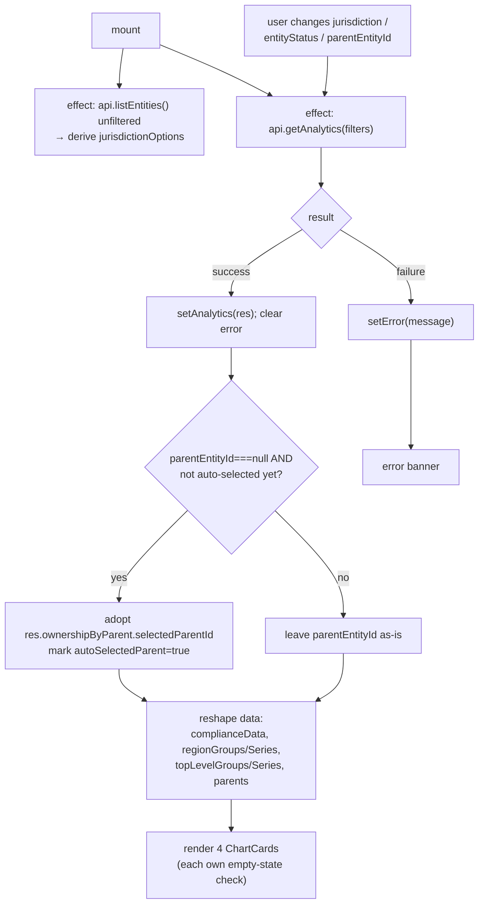

# `/analytics` — Analytics dashboard page

**File:** [`src/app/analytics/page.tsx`](../../src/app/analytics/page.tsx)
**Backend call:** `GET /api/analytics` (see [backend's analytics.md](../../../coverpin-backend/docs/routes/analytics.md))

Page-level `jurisdiction`/`entityStatus` filters above four charts:
compliance status breakdown, entity status by region, subsidiary/FQ counts
per top-level entity, and ownership % for a selected parent.

## Core logic

State: `jurisdiction`, `entityStatus` (page-level filters), `parentEntityId`
(drives just the ownership chart), `analytics` (`null` until first load),
`error`, `jurisdictionOptions`, plus an `autoSelectedParent` ref.

1. **Jurisdiction options effect** (mount-only) — same pattern as the list
   page: an unfiltered `api.listEntities()` call, deriving the jurisdiction
   set from every top-level entity and child, independent of the page's own
   filters.
2. **Main data effect** — re-runs on `jurisdiction`, `entityStatus`, or
   `parentEntityId` change. Calls `api.getAnalytics({ jurisdiction,
   entityStatus, parentEntityId })`. On success:
   - `setAnalytics(res)`, clear `error`.
   - **Auto-select the default parent once**: if the user hasn't picked a
     parent yet (`parentEntityId === null`) and this is the first response to
     carry one (`autoSelectedParent.current` still `false`), adopt the
     backend's `ownershipByParent.selectedParentId` into local state. This is
     what makes the ownership chart populated on first load without the user
     having to touch the dropdown — the backend already defaults to the
     alphabetically-first parent when none is requested (see the backend's
     analytics doc, aggregate (d)). The ref guard stops this from re-firing
     and stomping a parent the user explicitly changed afterward.
   - Same `cancelled`-flag pattern as the list page against stale responses.
3. **Chart data reshaping** (plain synchronous code, not memoized — cheap at
   this data scale):
   - `complianceData` / `complianceTotal` — passed straight through to
     `ComplianceBreakdownChart`; total used only to detect the empty state.
   - `regionGroups` / `regionSeries` — pivots the backend's flat
     `{ region, entityStatus, count }[]` into a `Map<region, Map<status,
     count>>`, then into the `BarGroup[]`/`BarSeries[]` shape
     `HorizontalBarChart` expects. Series are ordered by the canonical
     `ENTITY_STATUSES` list (filtered to statuses actually present), so
     colors/legend order stay consistent across renders regardless of
     response order.
   - `topLevelGroups` / `topLevelSeries` — one group per top-level entity,
     two fixed series (`subsidiaries`, `fqs`) colored via
     `RELATION_COLORS`.
   - `parents` — read straight from `analytics.ownershipByParent.parents`
     for the dropdown.
4. **Render**: `error` → banner; `analytics === null` → "Loading…";
   otherwise a 2-column grid of four `ChartCard`s, each independently
   showing its own empty state (`isEmpty` computed per chart, e.g.
   `complianceTotal === 0`) rather than gating the whole page on one
   combined check. The ownership card additionally gates on
   `parentEntityId` being non-null before rendering `OwnershipBar`.

## Flow diagram

