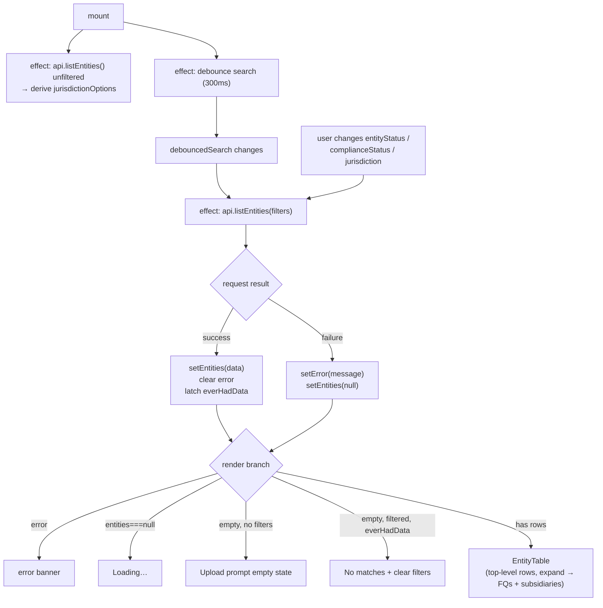

# `/` — Entity list page

**File:** [`src/app/page.tsx`](../../src/app/page.tsx)
**Backend call:** `GET /api/entities` (see [backend's entities.md](../../../coverpin-backend/docs/routes/entities.md))

Searchable/filterable table of top-level entities, each expandable to its
FQs and subsidiaries. This is the app's landing page.

## Core logic

State: `search` (raw input) / `debouncedSearch`, `entityStatus`,
`complianceStatus`, `jurisdiction` (filters — `'__all__'` sentinel means "no
filter"), `entities` (`null` = not yet loaded), `error`,
`jurisdictionOptions`, `everHadData`.

1. **Search debounce** — a 300ms `setTimeout` effect copies `search` into
   `debouncedSearch`; only `debouncedSearch` feeds the actual API call, so
   typing doesn't fire a request per keystroke.
2. **Jurisdiction options effect** (mount-only, `[]` deps) — calls
   `api.listEntities()` **unfiltered** once, and derives the full set of
   jurisdictions from every top-level entity *and* every child. This runs
   separately from the main data effect specifically so narrowing another
   filter never shrinks the jurisdiction dropdown's own option list. Failures
   here are swallowed — the main fetch below is what surfaces a real error
   state.
3. **Main data effect** — re-runs whenever `debouncedSearch`,
   `entityStatus`, `complianceStatus`, or `jurisdiction` changes. Calls
   `api.listEntities({ search, entityStatus, complianceStatus, jurisdiction })`
   (each `'__all__'` sentinel mapped back to `undefined` before the request).
   On success: `setEntities(res.data)`, clear `error`, and latch
   `everHadData = true` if any rows came back (used to distinguish "no data
   at all yet" from "filters matched nothing"). On failure: set `error` from
   `ApiError.message` (or a generic string) and null out `entities`. A
   `cancelled` flag discards the result of a request superseded by a newer
   filter change.
4. **Render branches**, in priority order: `error` → error banner;
   `entities === null` → "Loading…"; `entities.length === 0 &&
   !filtersActive` → true empty state (prompts upload); `entities.length ===
   0 && filtersActive && everHadData` → "no matches" empty state with a
   clear-filters button; otherwise → `<EntityTable entities={entities} />`.

## Expansion (`EntityTable`)

`children` (FQs then subsidiaries) is already flattened server-side onto
each top-level row — [`entity-table.tsx`](../../src/components/entity-table.tsx)
does no further data fetching. It just keeps a local `Set<string>` of
expanded row ids and renders `entity.children` as extra `<TableRow>`s when a
row's id is in that set; clicking a row with `children.length > 0` toggles
it. `RelationChip` (in [`entity-badges.tsx`](../../src/components/entity-badges.tsx))
distinguishes an `fq` child from a `subsidiary` child, and only subsidiary
rows show an ownership percentage (FQs don't have one).

## Flow diagram

