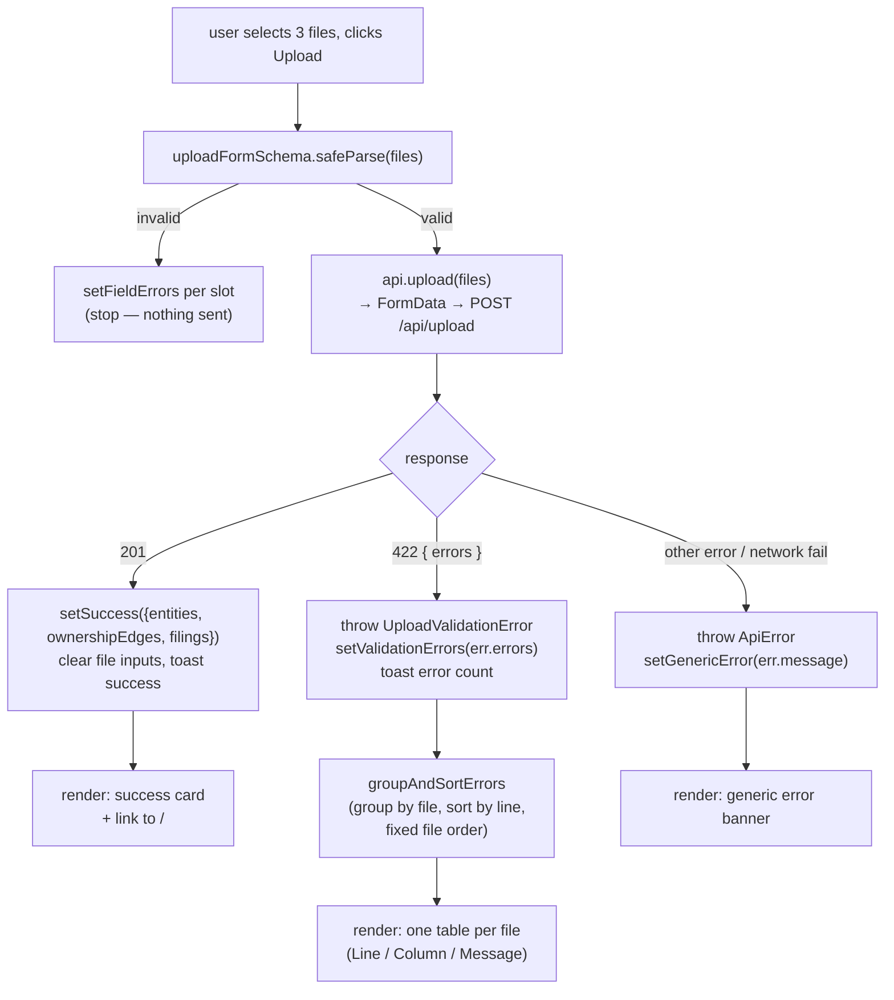

# `/upload` — Data upload page

**File:** [`src/app/upload/page.tsx`](../../src/app/upload/page.tsx)
**Backend call:** `POST /api/upload` (see [backend's upload.md](../../../coverpin-backend/docs/routes/upload.md))

Three file inputs (entities/ownership/filings), a client-side pre-check, then
a single multipart POST. Renders either a success summary or every
validation error grouped by file.

## Core logic

State: `files` (`Partial<Record<slot, File>>`), `fieldErrors` (client-side,
per-slot), `submitting`, `success`, `validationErrors` (server-side, from a
422), `genericError`.

1. **`onFileChange`** just stores the selected `File` object per slot and
   clears that slot's client-side error — no upload happens on selection.
2. **`onSubmit`**:
   - Resets all three result states (`success`, `validationErrors`,
     `genericError`) so a resubmission doesn't show stale results.
   - Runs `uploadFormSchema.safeParse(files)` (Zod, in
     [`lib/schemas.ts`](../../src/lib/schemas.ts)) — a **client-side-only**
     check (all three slots present) that catches the "forgot to attach a
     file" case before spending a round trip. Failures populate
     `fieldErrors` per slot and stop here; nothing is sent.
   - On success, builds a `FormData` (via `api.upload`, one `form.append`
     per slot using the field names the backend expects) and POSTs it.
   - **Three distinct outcomes**, distinguished by exception type from
     [`lib/api.ts`](../../src/lib/api.ts):
     - Success → `setSuccess(result)`, clear the file inputs, toast.
     - `UploadValidationError` (thrown when the response was `422` with an
       `errors` array) → `setValidationErrors(err.errors)`, toast with the
       error count. This is the backend's full per-row/column validation
       failure list — nothing was written server-side.
     - `ApiError` (any other non-OK response, or the fetch itself failing,
       e.g. backend unreachable) → `setGenericError(err.message)`.
   - `finally` clears `submitting` regardless of outcome.
3. **`groupAndSortErrors`** — pure function, re-run via `useMemo` whenever
   `validationErrors` changes: buckets errors by `file`, sorts each bucket by
   `line`, then orders the buckets `entities.csv → ownership.csv →
   filings.csv → (anything else)` so the rendered tables match the order a
   user would fix them in.
4. **Render**: the form is always visible. Below it, at most one of a
   `genericError` banner, a `success` summary card (row counts + link to
   `/`), or a validation-errors card (one table per file, `Line / Column /
   Message` columns) is shown, depending on which state is non-null.

## Flow diagram

